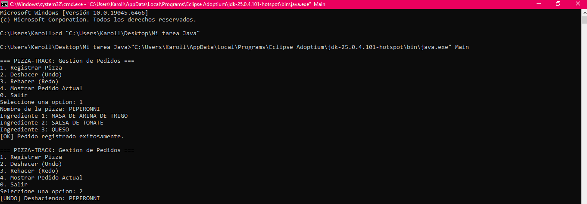
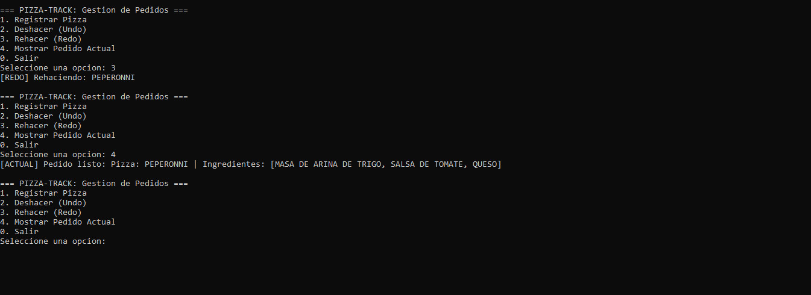

# Pizza-Track: Sistema de Gestión de Pedidos (Undo/Redo)

## Objetivo
Aplicar la estructura de datos lineal **Pila (Stack)** implementada sobre una **Lista Ligada manual** en Java para gestionar un sistema de pedidos de una pizzería con capacidades de Deshacer (**Undo**) y Rehacer (**Redo**).

## Integrantes del Equipo
- **Estudiante:** andrea carolina armenta rivera

## Capturas de Pantalla de la Consola

### 1. Registro y Consulta de Pedidos


### 2. Pruebas de Deshacer (Undo) y Rehacer (Redo)

---

## Instrucciones de Ejecución

1. Clonar o abrir el proyecto en **VS Code** (asegurar el JDK de Eclipse Temurin).
2. Compilar todas las clases desde la terminal:
   ```bash
   javac *.java